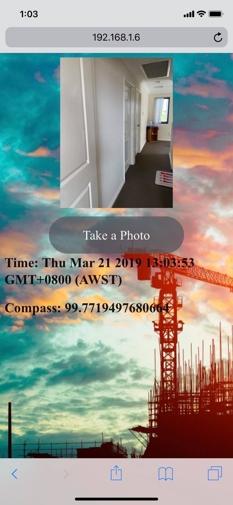

# Combine Computer vision and CCTV to do indoorpositioning - Master thesis

 

## Description

This project based on a scenario such as construction site verification, because when the engineer check in the construction site can not receive GPS signal, so the indoor positioning becomes a big issue.   

I try to combine deep learning and CCTV screen to do real-time indoor positioning.

I created the SSD model to detect the person in CCTV screen. when the person's bounding box detected, we can use homographic matrix to transfer the coordinate system of CCTV to coordinate system of the real world. In addition, to know the person's orientation, I develop an app that it can let a person take pictures and get compass of the device at the same time.

Cause project built on the web system, when the construction site engineer uses the app to take photos, the web will show the person's position on the 3D model.

##To Do

- Case study
- Draw the real-time person position on the 3D model
- Write a paper

## Written by

Roy Huang  

National Taiwan University 

Civil Engineering - Department of Computer-Aided Engineering 
