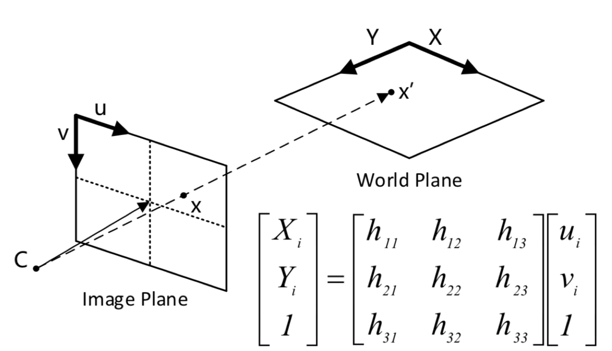

# Combine Computer vision and CCTV to do indoorpositioning - Master thesis

## Description

This project based on a scenario such as construction site verification, because when the engineer check in the construction site can not receive GPS signal, so the indoor positioning becomes a big issue.   

I try to combine deep learning and CCTV screen to do real-time indoor positioning.

I created the SSD model to detect the person in CCTV screen. when the person's bounding box detected, we can use homographic matrix to transfer the coordinate system of CCTV to coordinate system of the real world. In addition, to know the person's orientation, I develop an app that it can let a person take pictures and get compass of the device at the same time.

Cause project built on the web system, when the construction site engineer uses the app to take photos, the web will show the person's position on the 3D model.

## [Homography matrix][1]

Homography matrix transform used to transfer the coordinate system of CCTV to coordinate system of the real world. To solve the unknown parameters, I used 4 pairs of coordinates to find the value of each parameter. For the concept of homography matrix, see the image below:

To calculate the homography matrix, plz follow the steps below:

1. Find 4 pairs of coordinates.
2. use homography.py to calculate the transform.
3. pass parameters of the transform to www/extensions/homography.js

## To Do

- Case study
- Write a paper

## Written by

Roy Huang  

National Taiwan University 

Civil Engineering - Department of Computer-Aided Engineering 

## Reference

1. https://en.wikipedia.org/wiki/Homography_(computer_vision)

[1]: https://en.wikipedia.org/wiki/Homography_(computer_vision)
